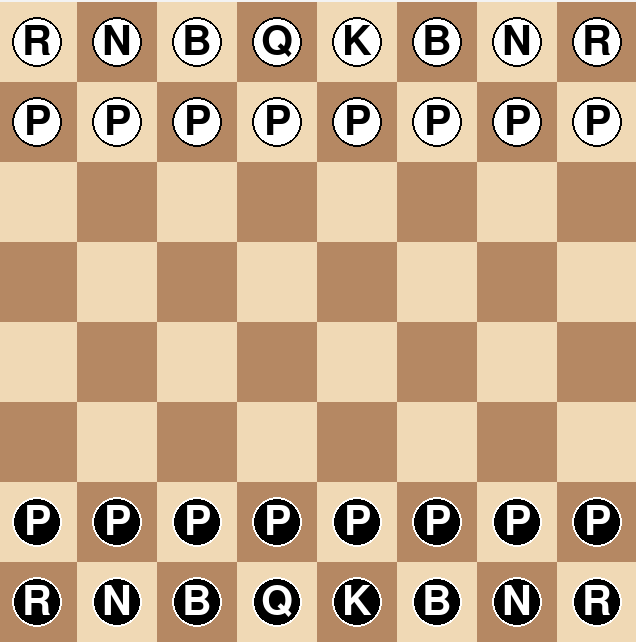

# 9班　チェスゲーム

## 実行環境の必要条件
* python >= 3.10
* pygame >= 2.1

## ゲームの概要
* ２人でチェスをしよう！

## ゲームの遊び方
* クリックでコマを選択し、移動
* 敵のキングを倒そう

## ゲームの実装
### 共通基本機能
* コマと板の作成(平野)

### 分担追加機能
* キングの駒の動作処理(浅羽)
* ポーンの駒の動作処理(岩瀬)
* ナイトの駒の動作処理(中村)
* ルーク・クイーンの駒の動作処理(鳥山)
* ビショップの駒の動作処理(平野)

### ToDo
- [ ] コマ移動
- [ ] 特殊移動
